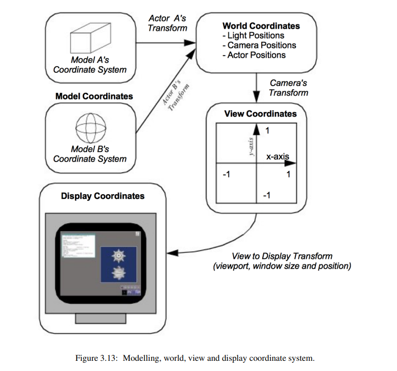

# 坐标系

## 计算机图形学坐标系系统
计算器图形学通常包含四个坐标系，分别是model, world, view, and display。

## 医学影像领域坐标系系统

### 患者坐标系
患者坐标系（Anatomical Coordinate System）也称为解剖学坐标系。

该坐标系由三个平面组成，用于描述人体的标准解剖位置：
- 轴向平面（Axial plane） ：垂直于人体的前后方向。
- 矢状面（Sagittal plane） ：垂直于人体的左右方向。
- 冠状面（Coronal plane） ：垂直于人体的上下方向。

3D Slicer中使用RAS坐标系，而在DICOM标准中则使用LPS坐标系。

- RAS坐标系：右侧（Right）、前侧（Anterior）、头侧（Superior）
- LPS坐标系：左侧（Left）、后侧（Posterior）、头侧（Superior）

Q: 患者坐标系是一个model坐标系？

### 图像坐标系/体素坐标系（IJK）

### 3D slicer坐标系系统
RAS坐标系：世界坐标系
IJK坐标系：图像数据的体素坐标系
Slice坐标系：表示2D切片的局部坐标系
XY坐标系：2D切片视图中的像素坐标系
UVW坐标系：3D体绘制的局部坐标系

## 参考资料
- VTKTextBook: https://vtk.org/vtk-textbook/
- 3D slicer: https://github.com/Slicer/Slicer/blob/main/Docs/user_guide/coordinate_systems.md